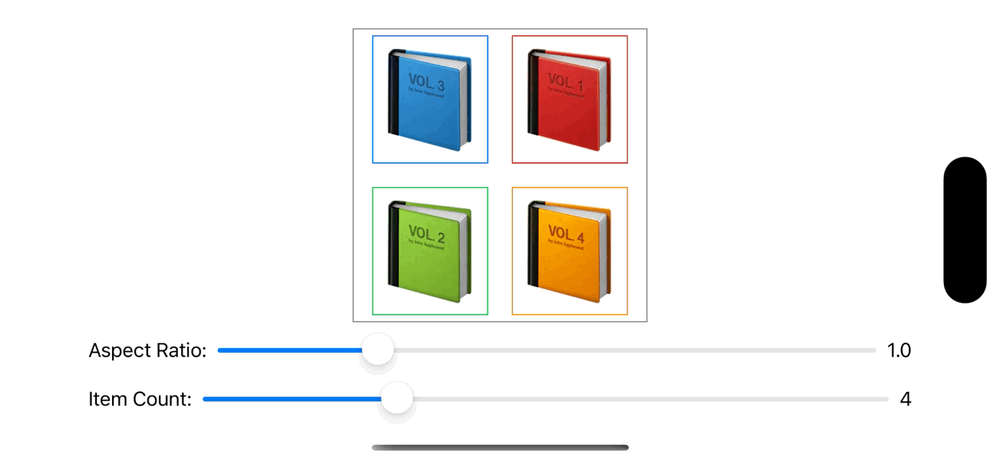

# FlexibleStack

This provides flexible stack layout in SwiftUI.

Optimizes the arrangement of items according to the aspect ratio of the parent view.


Optimize the arrangement of items according to the number of them.


## Requirements

- Development with Xcode 15.2+
- Written in Swift 5.9
- swift-tools-version: 5.9
- Compatible with iOS 16.4+

## Usage

```swift
struct ContentView: View {
    let colors: [Color] = [.blue, .red, .green, .orange]

    var body: some View {
        FlexibleVStack {
            ForEach(colors.indices, id: \.self) { index in
                Rectangle()
                    .foregroundStyle(colors[index])
                    .frame(maxWidth: .infinity, maxHeight: .infinity)
            }
        }
        .padding()
    }
}
```
